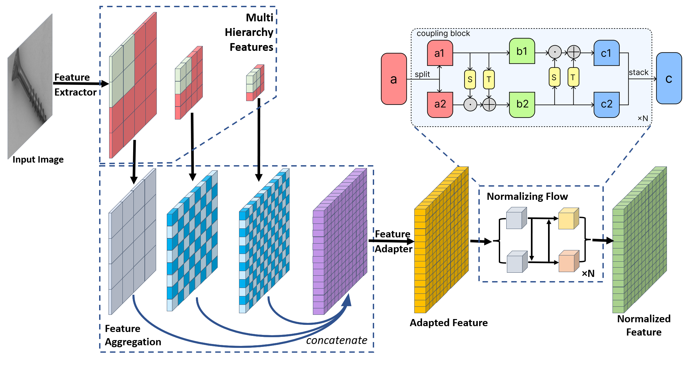
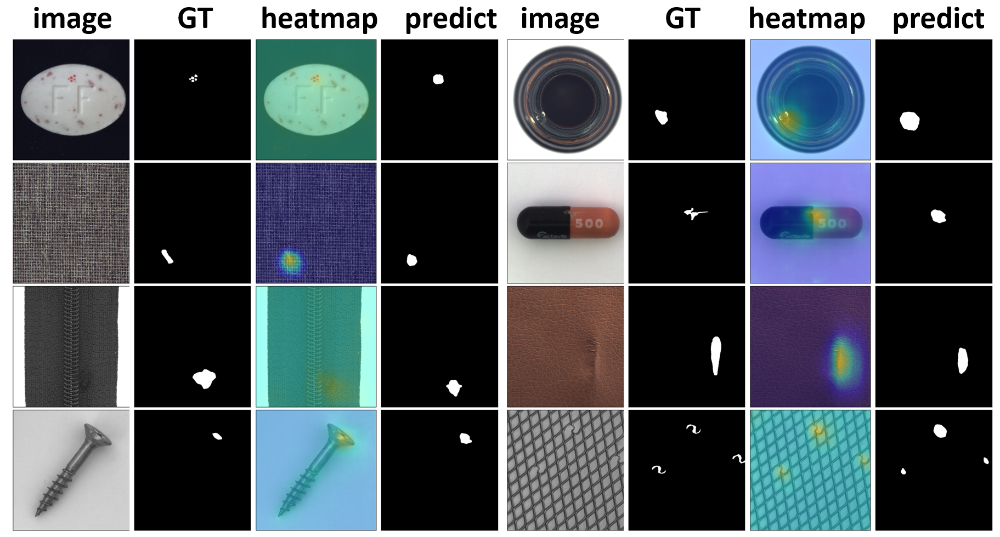

# PatchFlow

Official implementation of [**PatchFlow: Leveraging a Flow-Based Model with Patch Features**](https://arxiv.org/abs/2602.05238).

PatchFlow is also integrated into [**Anomalib**](https://github.com/open-edge-platform/anomalib/tree/release/lib/v2.4.0), with support for both **DINOv2** and **EfficientNet** backbones.

PatchFlow is an anomaly detection method for industrial product images. It combines local neighbor-aware patch features with a normalizing flow model, and closes the gap between a generic pretrained feature extractor and industrial imagery via a lightweight feature adapter.

- **MVTec AD** — image-level AUROC: **99.28%**
- **VisA** — image-level AUROC: **96.48%**


## Method



PatchFlow has four components:

1. **Pretrained feature extractor** — multi-level representations from multi-scale inputs.
2. **Feature aggregation** — merges descriptors across hierarchical levels and scales.
3. **Feature adapter** — reduces dimensionality and bridges the pretraining/industrial domain gap.
4. **Normalizing flow** — maps adapted features to a standard distribution for likelihood-based scoring.

## Results

Per-pixel anomaly ground truth, predicted heatmap, and predicted mask:



### MVTec AD — per-category image-level AUROC

| Category    | DRÆM     | CutPaste | CFlow-AD  | CS-Flow | PADIM | PatchCore | PatchFlow (Ours) |
| ----------- | -------- | -------- | --------- | ------- | ----- | --------- | ---------------- |
| Carpet      | 97.0     | 93.9     | 98.98     | 100     | 99.1  | 98.7      | **100**          |
| Grid        | 99.9     | **100**  | 97.64     | 99.0    | 97.3  | 98.2      | 99.83            |
| Leather     | 100      | 100      | 98.98     | 100     | 99.2  | 100       | **100**          |
| Tile        | 99.6     | 94.6     | 99.25     | **100** | 94.1  | 98.7      | 99.10            |
| Wood        | 99.1     | 99.1     | 98.99     | **100** | 94.9  | 99.2      | 99.65            |
| Bottle      | 99.2     | 98.2     | 98.89     | 99.8    | 98.3  | 100       | **100**          |
| Cable       | 91.8     | 81.2     | **99.66** | 99.1    | 96.7  | 99.5      | 99.01            |
| Capsule     | 98.5     | 98.2     | **98.56** | 97.1    | 98.5  | 98.1      | 97.21            |
| Hazelnut    | 100      | 98.3     | 98.95     | 99.6    | 98.2  | 100       | **100**          |
| Metal Nut   | 98.7     | 99.9     | 98.86     | 99.1    | 97.2  | 100       | **100**          |
| Pill        | **98.9** | 94.9     | 98.01     | 98.6    | 95.7  | 96.6      | 97.35            |
| Screw       | 93.9     | 88.7     | **98.93** | 97.6    | 98.5  | 98.1      | 98.34            |
| Toothbrush  | 100      | 99.4     | 97.99     | 91.9    | 98.8  | 100       | **100**          |
| Transistor  | 93.1     | 96.1     | 96.65     | 99.3    | 97.5  | **100**   | 99.54            |
| Zipper      | **100**  | 99.9     | 99.08     | 99.7    | 98.5  | 99.4      | 99.21            |
| **Average** | 98.03    | 96.1     | 98.62     | 98.7    | 97.5  | 99.1      | **99.28**        |

## Repository layout

```
main.py              entry point: build dataloaders, train or load, evaluate
model.py             PatchflowModel definition
train.py             training loop
evaluate.py          image- and pixel-level AUROC
data.py              dataset and dataloader construction
anomaly_map.py       anomaly score / heatmap generation
loss.py              loss functions
metrics.py           evaluation metrics
utils.py             save/load helpers and utilities
gen_validation_set.py validation split generation
```

## Usage

Point `datapath` and `category` in `main.py` to your dataset root (MVTec AD or VisA), then:

```bash
python main.py
```

To train from scratch, uncomment the training block in `main.py`:

```python
model = train_model(model, train_loader, 10)
save_model(model, 'patchflow.pt')
```

To evaluate a trained checkpoint:

```python
model = load_model(model, 'patchflow.pt')
image_auroc(model, test_loader)
```

Multi-GPU training and checkpoint save/load are supported (see recent commits).

## Citation

```bibtex
@misc{zhang2026patchflowleveragingflowbasedmodel,
      title={PatchFlow: Leveraging a Flow-Based Model with Patch Features},
      author={Boxiang Zhang and Baijian Yang and Xiaoming Wang and Corey Vian},
      year={2026},
      eprint={2602.05238},
      archivePrefix={arXiv},
      primaryClass={cs.CV},
      url={https://arxiv.org/abs/2602.05238}
}
```
